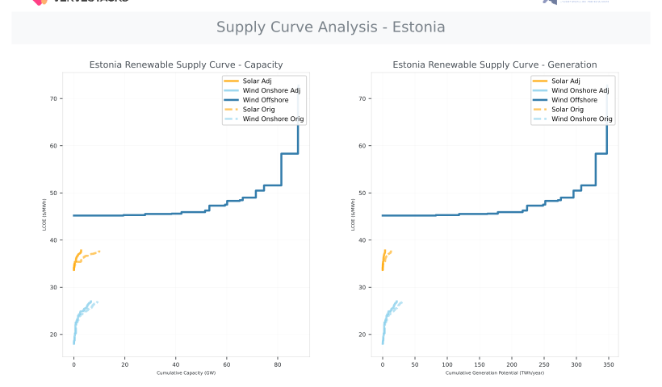
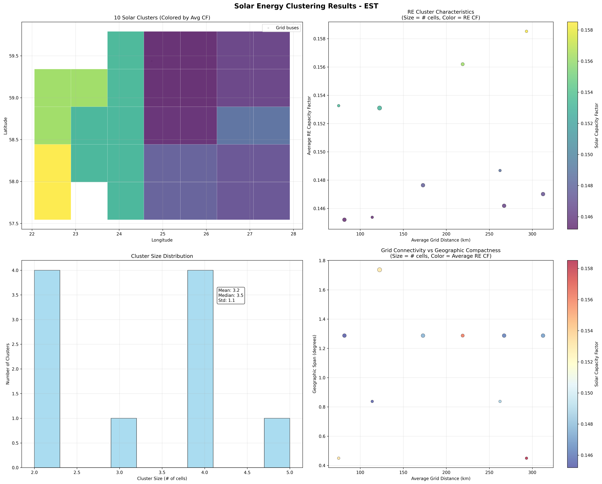
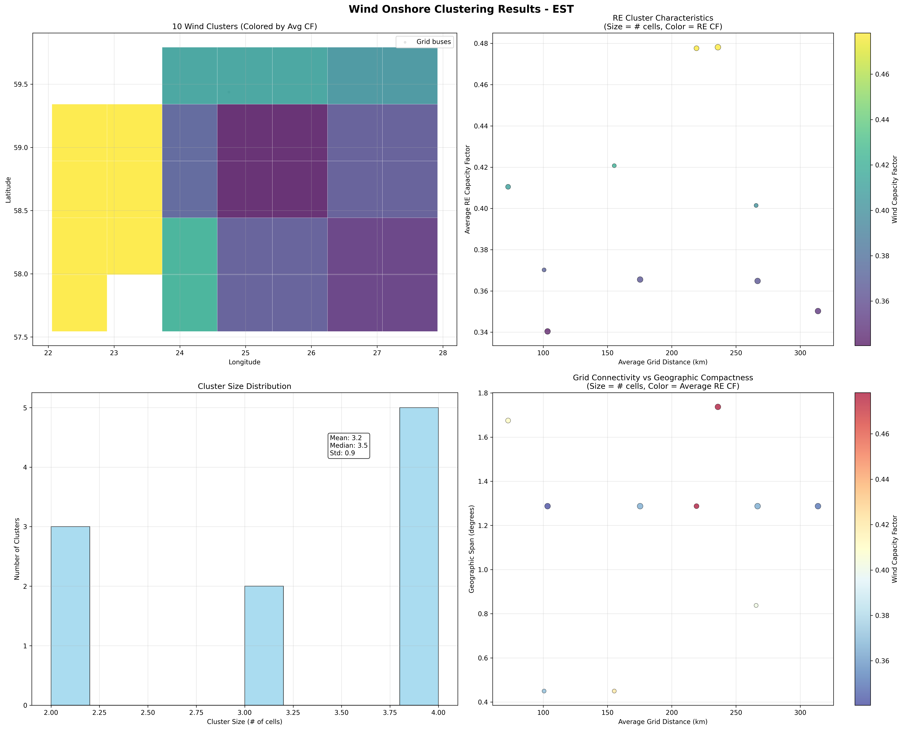
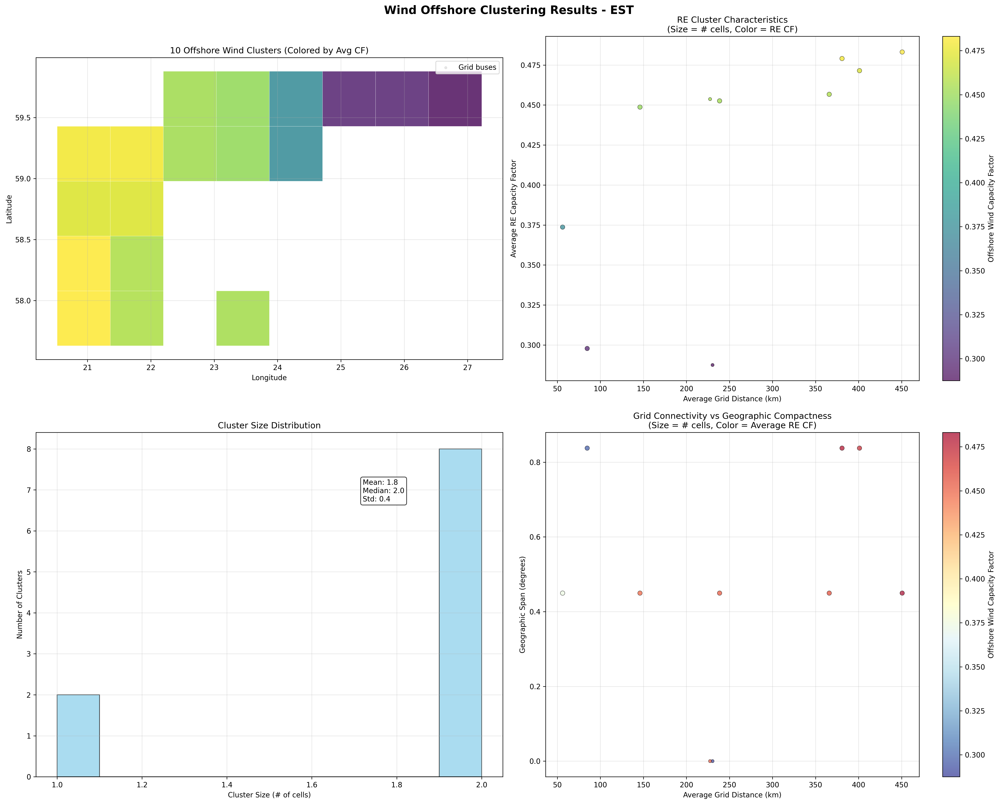
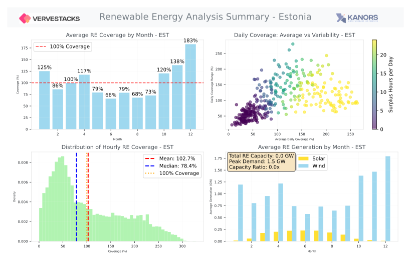
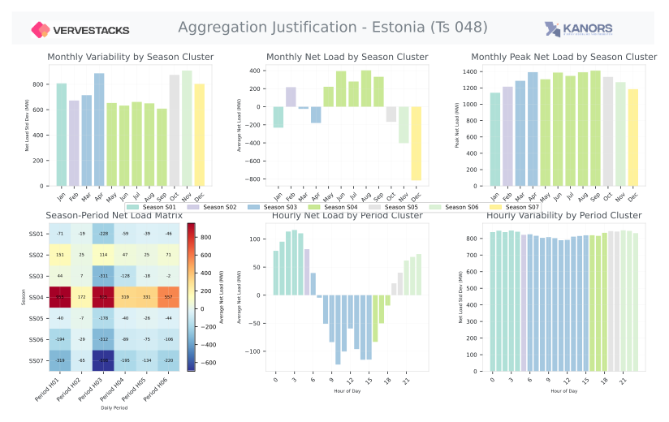
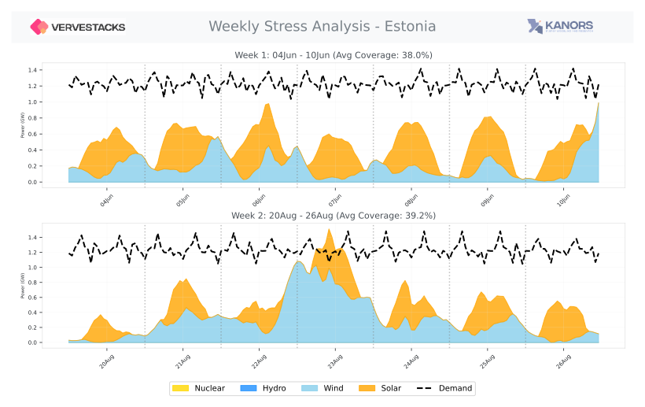
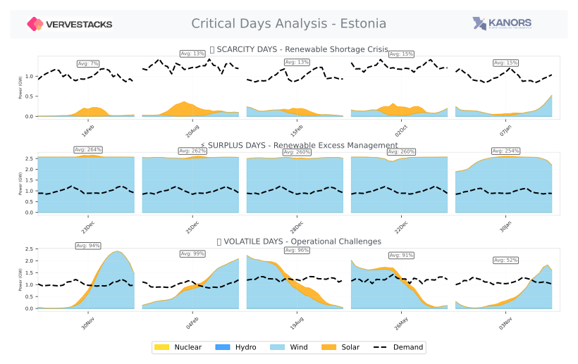
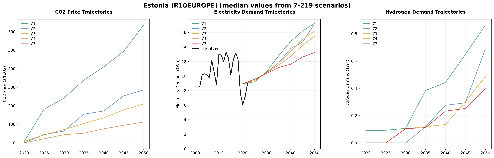

Original repo belongs to vervestacks_models:  https://github.com/akanudia/vervestacks_models/tree/main?tab=readme-ov-file

# VerveStacks Model Generation Notes - EST
**Generated:** 2025-09-25 16:48:34


## Model Calibration 2022

| **Total Capacity** | **Total Generation** | **CO2 Emissions** | **Calibration to EMBER** |
|--------------|---------------|------------|--------------------------|
| 1.8 GW | 8.9 TWh | 0.796 Mt | 18.2% |

**Note:** 2022 fossil and bio capacity is calibrated to EMBER and renewable capacities to IRENA. UNSD has incomplete data for fuel consumption, so the calibration is demonstrated against the total CO2 emission reported by EMBER. This shows that the efficiency assumptions are good.


## Power Generation Assets

### Existing Capacity

| **Fuel Type** | **Threshold** | **Plants Above Threshold** | **Active Capacity** | **Wtd Avg Efficiency** |
|---------------|---------------|----------------------------|--------------------|-----------------|
| 🌱 **Bioenergy** | 50 MW | 1/1 plants | 0.3 GW | 34% |
| 🔥 **Gas** | 10 MW | 2/2 plants | 0.42 GW | 38.6% |
| 💧 **Hydro Power** | 10 MW | 0/1 plants | 0.008 GW | 33.1% |
| 🛢️ **Oil** | 10 MW | 1/1 plants | 0.251 GW | 36% |
| ☀️ **Solar** | 200 MW | 0/15 plants | 0.642 GW | 87% |
| 💨 **Windon** | 200 MW | 1/17 plants | 0.733 GW | 96% |


### Future Projects (offered for endogenous selection)

| **Fuel Type** | **Threshold** | **Plants Above Threshold** | **Total Capacity** | **Wtd Avg Efficiency** |
|---------------|---------------|----------------------------|--------------------|-----------------|
| 🔥 **Gas** | 10 MW | 2/2 plants | 0.3 GW | 60% |
| ☀️ **Solar** | 200 MW | 0/1 plants | 0.074 GW | 100% |
| 🌊 **Windoff** | 200 MW | 12/13 plants | 12.8 GW | 100% |
| 🔋 **Pumped Storage** | 10 MW | 2/2 plants | 0.775 GW | 100% |


Announced and pre-construction projects are offered as options to the model for endogenous investment. This is particularly useful for hydro and pumped storage as country-wise potential is not readily available. We also get grid locations of all these units.

### 🔄 CCS Retrofit Potential
| **Fuel Type** | **Retrofit Host Capacity** | **Retrofit Potential Capacity**
|---------------|----------------------------|-------------------------------|
| ⚫ **Coal** | 0 GW | 0 GW after capacity penalty |
| 🔥 **Gas** | 0.72 GW | 0.608 GW after capacity penalty |


## Data, Assumptions & Coverage

### Primary Data Sources

#### Base-Year Power Plant Specifications
- **Global Energy Monitor (GEM)** [🌐](https://globalenergymonitor.org)  
  Open-access database of individual power plants worldwide, including location, capacity, fuel type, commissioning year, and technical specifications.
- **International Renewable Energy Agency (IRENA)** [🌐](https://www.irena.org/Statistics)  
  Global renewable energy capacity and generation statistics (2000–2022), disaggregated by country and technology.
- **EMBER Climate** [🌐](https://ember-climate.org/data/)  
  Global dataset tracking electricity generation, installed capacity, and emissions intensity (2000–2022).

#### Enhanced Renewable Energy Characterization
- **GEM-REZoning-Atlite Integration** [`re_units_cf_grid_cell_mapping.csv`]  
  Enhanced renewable energy units with capacity factors from Atlite weather data and precise grid cell locations from REZoning database. This integration provides spatially-resolved capacity factors for existing renewable plants, enabling accurate performance modeling and grid cell assignment for spatial optimization.
- **Capacity Factor Enhancement**: Individual renewable plants receive location-specific capacity factors derived from 2013 hourly weather patterns
- **Spatial Grid Assignment**: Plants mapped to 50x50km REZoning grid cells for consistent spatial modeling

### Data Processing Notes
- **Individual Plant Coverage**: 93%% of total capacity from plant-level GEM data
- **Total Capacity Tracked**: 16.3 GW GW from all sources
- **Plants Above Threshold**: 23 individual plants tracked
- **Total Plants Processed**: 55 plants in database
- **Missing Capacity Added**: - **EMBER data**:
  - **bioenergy**: 0.3 GW
  - **gas**: 0.21 GW


## Model Structure

### Files Included
- **Source Data**: `source_data/VerveStacks_EST.xlsx` - the full dataset in a model-agnostic format
- **VEDA Model Files**: Complete model ready for Veda-TIMES execution
- **Scenario Files**: NGFS climate scenarios and policy assumptions


## Renewable Energy Characterization

VerveStacks provides comprehensive renewable energy potential analysis at unprecedented spatial resolution, 
combining global resource assessments with realistic deployment constraints to deliver actionable insights 
for energy system planning.

### **Data Foundation: REZoning Integration**

Our renewable energy characterization builds on the REZoning database, providing detailed potential 
assessments at 50×50 km grid resolution across 190+ countries. This high-resolution spatial data 
captures the nuanced variations in renewable energy resources that are critical for accurate energy 
system modeling.

**Data Sources:**
- **Solar Potential**: REZoning solar resource data with capacity factors and LCOE estimates
- **Wind Onshore**: REZoning onshore wind potential with economic viability assessments  
- **Wind Offshore**: REZoning offshore wind resources with marine-specific constraints
- **Hourly Profiles**: Atlite-derived capacity factor time series for each grid cell

### **Land Use Conflict Resolution: Conservative Overlap Management**

A critical challenge in renewable energy assessment is avoiding double-counting of land areas suitable 
for both solar and wind development. VerveStacks implements a **conservative overlap resolution algorithm** 
that ensures realistic deployment scenarios:

**Most Pessimistic Assumption:**
- When grid cells overlap between solar and wind potential, we apply **LCOE-based allocation**
- The technology with **higher LCOE (less competitive)** receives a **reduced share** of the overlapping area
- This conservative approach ensures our estimates represent **deployable potential** rather than theoretical maximums
- **No double-counting**: Each grid cell contributes to less than the REZoning resource limits in cells with overlap

This methodology reflects real-world deployment patterns where developers choose the most economically 
viable technology for each location, ensuring our supply curves represent **realistic, achievable 
renewable energy potential**.

### **Supply Curve Visualization**

The resulting supply curves reveal the economic characteristics of renewable energy deployment, 
showing how costs evolve as more capacity is developed:

**Chart Features:**
- **LCOE vs Cumulative Capacity**: Economic viability as deployment scales
- **LCOE vs Cumulative Generation**: Resource potential in energy terms
- **Technology Comparison**: Solar, Wind Onshore, and Wind Offshore potential
- **Original vs Landuse-Adjusted**: Impact of conservative overlap management

<div align="center">

</div>

This analysis provides the foundation for understanding renewable energy economics and informs 
capacity expansion decisions in the VEDA/TIMES energy system models.


### Renewable Energy Clustering

VerveStacks employs **intelligent spatial clustering** to transform high-resolution renewable energy 
grid cells into manageable clusters while preserving essential resource characteristics and geographic diversity.

#### **Clustering Overview**

| **Clustering Metric** | **Value** | **Description** |
|----------------------|-----------|-----------------|
| **Grid Cells Processed** | 32 | 50×50km renewable energy grid cells |
| **Clusters Generated** | 10 | Dynamically determined using n = cells^0.6 |
| **Average Cluster Size** | 3.2 grid cells | Mean grid cells per cluster |
| **Cluster Size Range** | 2 to 5 grid cells | Variation in cluster composition |
| **Grid Definition** | Cities as transmission bus proxies | Transmission infrastructure basis |

#### **Multi-Feature Clustering Algorithm**

The clustering process combines multiple data dimensions to create economically and spatially coherent renewable energy zones:

**Feature Weighting:**
- **Wind Profiles**: 35% - Temporal generation patterns and variability
- **Solar Profiles**: 35% - Complementary temporal characteristics  
- **Grid Distance**: 20% - Infrastructure connectivity and transmission costs
- **Spatial Coordinates**: 10% - Geographic proximity and regional coherence

**Technical Implementation:**
- **Algorithm**: Hierarchical clustering with Ward linkage
- **Preprocessing**: PCA dimensionality reduction (50 components per technology)
- **Standardization**: All features normalized before clustering
- **Distance Metric**: Euclidean distance in transformed feature space

#### **Capacity-Weighted Profile Aggregation**

Each cluster receives a **capacity-weighted hourly profile** that preserves the temporal characteristics 
of constituent grid cells while accounting for their relative renewable energy potential:

```
cluster_profile[hour] = Σ(grid_cell_profile[hour] × capacity_weight[cell]) / Σ(capacity_weight[cell])
```

This approach ensures that grid cells with higher renewable energy potential have proportionally 
greater influence on the cluster's temporal generation pattern, maintaining economic rationality 
in the aggregated profiles.

#### **Geographic Hedging Benefits**

**Why Clustering Matters**: Even in non-grid models, renewable energy clustering preserves critical 
**geographic hedging** effects that are essential for realistic energy system modeling:

- **Wind Resource Diversity**: Captures spatial variations in wind patterns and seasonal differences
- **Solar Complementarity**: Preserves east-west and north-south solar resource variations
- **Grid Connection Costs**: Maintains distance-based connection costs to transmission infrastructure
- **Temporal Smoothing**: Geographic diversity reduces overall system variability

**Universal Application**: Both grid and non-grid models use identical clustering methodology, 
differing only in their synthetic grid definition (actual transmission vs. population centers).

#### **Quality Filtering**

Only economically viable renewable resources are included in the clustering process:
- **Solar PV**: Grid cells with <5% capacity factor excluded
- **Onshore Wind**: Grid cells with <8% capacity factor excluded
- **Resource Focus**: Ensures clustering represents deployable potential, not theoretical maximums

#### **Clustering Visualizations**

The following visualizations show the spatial distribution of renewable energy clusters for each technology, 
demonstrating how the algorithm balances resource quality, geographic diversity, and grid connectivity:

**Solar PV Clustering:**
<div align="center">
  
  <p><em>Solar PV clustering showing 10 clusters from 32 grid cells using Cities as transmission bus proxies</em></p>
</div>

**Onshore Wind Clustering:**
<div align="center">
  
  <p><em>Onshore wind clustering showing 10 clusters from 32 grid cells using Cities as transmission bus proxies</em></p>
</div>

**Offshore Wind Clustering:**
<div align="center">
  
  <p><em>Offshore wind clustering showing 10 clusters from 32 grid cells using Cities as transmission bus proxies</em></p>
</div>

**Visualization Features:**
- **Technology-specific clustering**: Each renewable technology clustered independently
- **Color-coded clusters**: Each cluster shown in distinct colors
- **Grid cell boundaries**: 50×50km renewable energy zones
- **Transmission infrastructure**: Cities as transmission bus proxies overlaid for context
- **Resource quality**: Cluster composition reflects capacity factor variations


## Temporal Modeling & Timeslice Analysis

### Advanced Stress Period Identification

This model employs sophisticated **statistical scenario generation** to identify critical periods in high-renewable energy systems:

#### 🔥 **Scarcity Periods** - Renewable Shortage Crisis
- Days with lowest renewable energy coverage relative to demand
- Critical for capacity planning and storage requirements
- Identifies when conventional backup power is most needed

#### ⚡ **Surplus Periods** - Renewable Excess Management  
- Days with highest renewable generation exceeding demand
- Essential for curtailment analysis and export/storage strategies
- Shows opportunities for demand shifting and industrial electrification

#### 🌪️ **Volatile Periods** - Operational Challenges
- Days with highest generation variability and unpredictability
- Important for grid stability and flexible resource planning
- Captures rapid ramping requirements for dispatchable assets

### Comprehensive Stress Period Analysis

The following visualizations provide detailed insights into temporal patterns and critical periods:

#### **Renewable Energy Analysis Overview**
<div align="center">

</div>

#### **Aggregated months and hours (8 X 8 case)**
<div align="center">

</div>

#### **Weekly Stress Periods (Extended Analysis)**
<div align="center">

</div>

#### **Triple-5 Critical Periods (Comprehensive Stress Analysis)**
<div align="center">

</div>

### Timeslice Structure Generation
**Multi-Scale Temporal Resolution:**
- **Base Aggregation**: 6 seasons × 8 daily periods = 48 base timeslices
- **Critical Period Enhancement**: Additional segments for identified stress periods


## AR6 Climate Scenarios - R10EUROPE

This model incorporates climate scenario drivers from the IPCC AR6 database for the **R10EUROPE** region, 
derived from 350 vetted scenario-model combinations spanning 5 climate categories 
from ambitious 1.5°C pathways (C1) to limited mitigation trajectories (C7). The scenarios cover 
7 years from 2020 to 2050, providing comprehensive 
pathways for energy system transformation under different climate policy futures.


### Climate Scenario Trajectories

<div align="center">
  
  <p><em>Climate scenario trajectories showing CO2 prices, electricity growth, and hydrogen deployment across different climate ambitions</em></p>
</div>

**Key Insights:**
- **5 Climate Categories**: From 1.5°C pathways to baseline scenarios
- **350 Scenario-Model Combinations**: Comprehensive coverage of transformation pathways  
- **Regional Context**: R10EUROPE region-specific climate policy patterns
- **Temporal Coverage**: 2020-2050 transformation trajectories


### Scenario-Model Divergence Analysis

**Model Agreement**: Analysis across 350 scenario-model combinations reveals:
- **High Convergence**: CO2 pricing trajectories (CV: inf%) and electricity growth (CV: 17.2%)
- **Moderate Uncertainty**: Transport electrification rates (CV: 59.8%) 
- **High Divergence**: Hydrogen deployment pathways (CV: inf%)

**Regional Characteristics**: The R10EUROPE region shows moderate convergence compared to global 
averages, with region-specific climate policy patterns reflecting economic and policy context.


## Quality Assurance

- Cross-validation between IRENA, EMBER, and UNSD statistics
- Capacity-generation consistency checks
- Technology classification verification
- Historical data reconciliation for base year (2022)
- Renewable resource potential validated against REZoning database
- Temporal analysis verified through statistical scenario methods


## Usage Notes

- For questions about specific data sources or methodology, refer to online documentation
- Model parameters can be adjusted manually in the model files

---
*Generated by VerveStacks Energy Model Processor*
*For more information: [VerveStacks Documentation](https://vervestacks.readthedocs.io/en/latest/)*
